   
  

# Mist Engine HUD

**Mist Engine HUD:** is a simple always-open, never-in-the-way HUD for _City of Mist_, _Otherscape_ AND ***LEGEND IN THE MIST! [NEW!]*** game systems made [by Taragnor for Foundry](https://foundryvtt.com/packages/city-of-mist). It allows players to quickly select tags and statuses and do the Moves rolls, with no questions or menus to answer. Just select what you need and roll using the Moves in the Hotbar. Fast and streamlined like any _action-packed game_ should be! (this module completely replaces the CoM Character HUD, you can uninstall it).

## NEW ADDITION: Legend in the Mist HUD!

[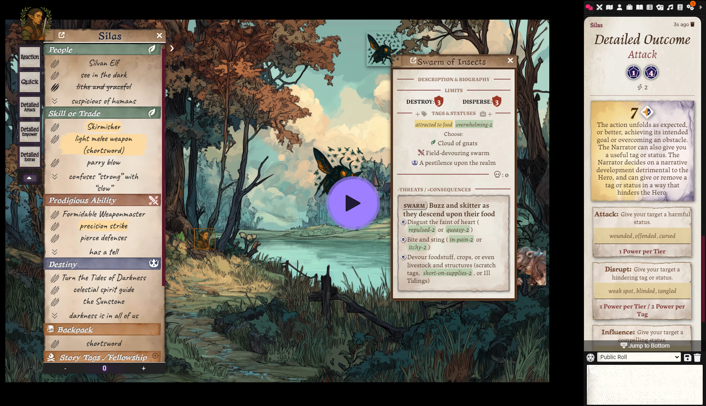](https://www.loom.com/share/63649a72e05d40fa87f72f73b9bbbd24?sid=e7649bf9-b358-4540-ad70-5a78f297cf46)

Click on the image for an awesome setup tutorial made by McMaia

## Features

**Always-visible HUD**: Provides quick access to theme tags and statuses. You only have to select a PC token

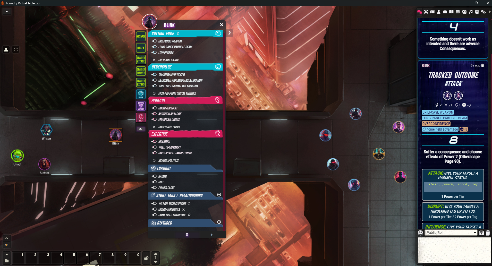

**Danger/Threats HUD**: Keep the enemies close and at hand. Right-click on any Danger/Threat token to call the HUD

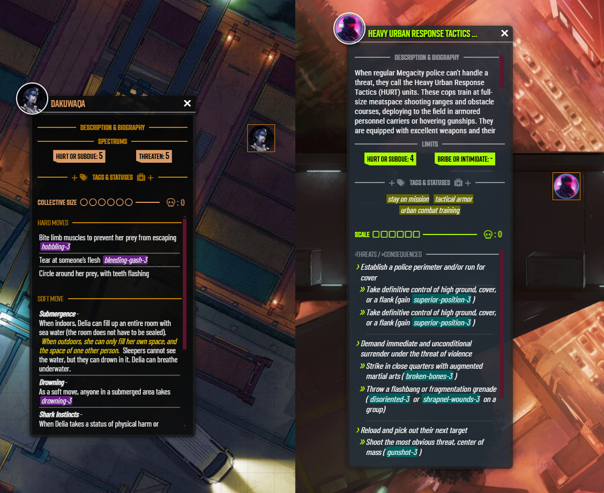

**Statuses and Tags Dragn'Drop**: you can drag statuses and story tags over the tokens to assign them.

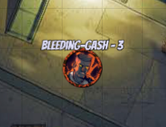

**Four Awesome Dice Sets**: the characteristic modified D6 to a D12 with faces from one to six. One set for _City of Mist_ and three sets for _Otherscape_: Noise, Mythos, and Self

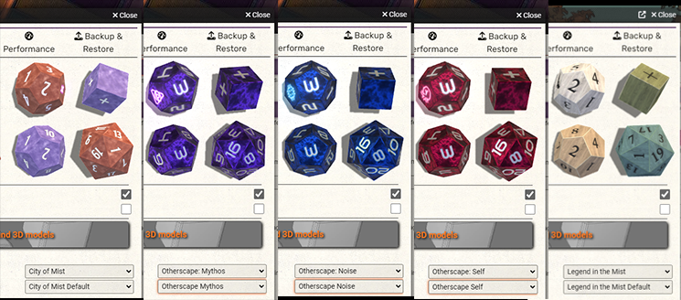

**Quick Roll**: Roll by selecting tags and clicking on the moves button. No questions asked!

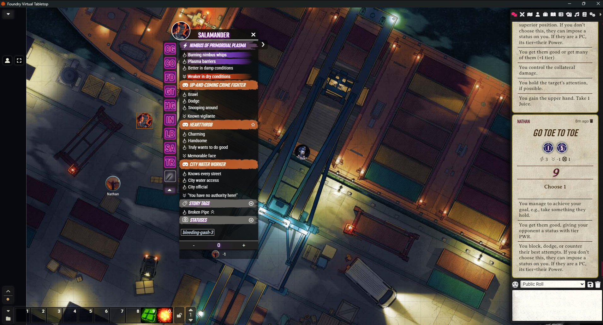

**Draggable**: Drag it around, see your game while playing it! Double-click the header to minimize it.

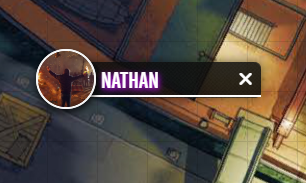

### Other features (see pics along the text below)

- **Dynamite Moves Control Panel**: an easy way for the MC to determine which move is always Dynamite for a character
- **Hide Scene Window**: Toggle the scene tags window with a click
- **MC Statuses List**: Lots of statuses organized by category, no more missing the screen just because you're playing online
- **NPC influence Viewer**: keep tabs on your threats in a simple panel and jump to any of them with a click  

## Installation

In Foundry VTT, go to the Add-on Modules tab and click Install Module. Then:

1. Search in the top bar for "mist hud" and click on the Install button of the module
2. Enable the module in your Game Settings under Manage Modules

OR

1. Paste the following manifest URL into the bottom Manifest URL field:

    https://github.com/mordachai/mist-hud/raw/main/module.json

2. Enable the module in your Game Settings under Manage Modules

## Usage

Once installed and activated, the HUD will automatically appear when a character token is selected **(right-click for NPCs)**.

Choose your game in the City of Mist game settings: _City of Mist_ or _Otherscape_. Legends in the Mist is not supported by the HUD (yet).

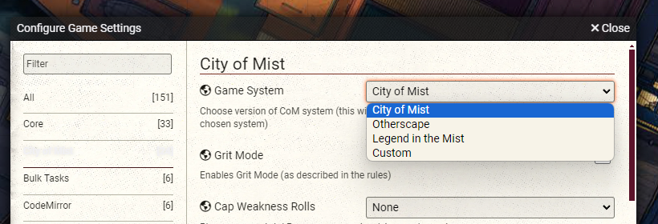

## Character's HUD: Tags! Statuses! Roll!

1. Select your character token.
2. Choose TAGS (Power, Weakness, Story, Loadout) from the HUD. SCENE story tags and statuses can be used, select them normally.
    - You can mark a tag to be burned on the next roll, giving you an edge at a price as in the game rules. Burned tags cannot be selected, click on the fire icon again to "unburn" the tag and recover it.
    - Invert a weakness to be used as a _power tag_ by clicking on the double arrow icon. You can also invert story tags.
3. Choose STATUSES. Click on them to toggle if they are positive, negative, or neutral (CoM, LitM / Otherscape):
    - Yellow / Blue (+): will add their tier to the roll result
    - Red / Orange  (-): will subtract their tier from the roll result
    - No Color (0): will do nothing to the roll. If a status has no use in the next roll let it be like this

4. Click the corresponding move button on the left side of the HUD. There are moves for City of Mist and Otherscape available, depending on the selected system in the City of Mist game settings.

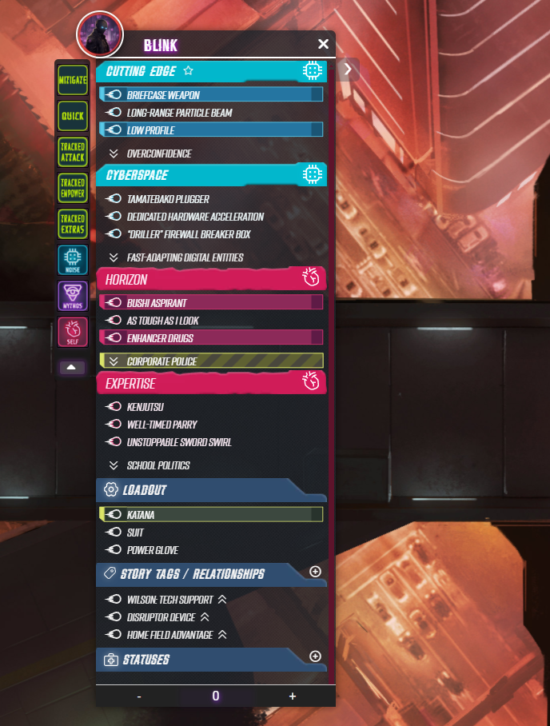

Roll results, outcomes, and move effects will be displayed on the chat. Clicking on the modifiers below the dice results shows the tags and statuses that were used. Each icon represents a type of modifier:

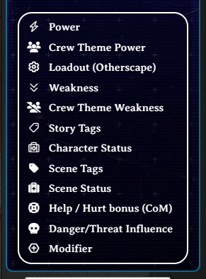

Clicking on the Tracked Outcomes (Otherscape) displays suggested tags.

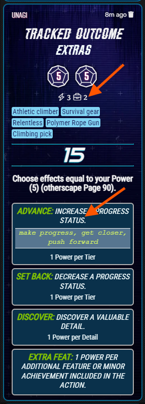

### Burning Tags

You can select tags to burn before you roll. Click on the burn icon, select other tags or statuses if needed and roll. The roll message in the chat will display the tags that were burned and the HUD will update the tags to the burned state.

City of Mist: Burn to Hit >> only one "to burn" tag is counted
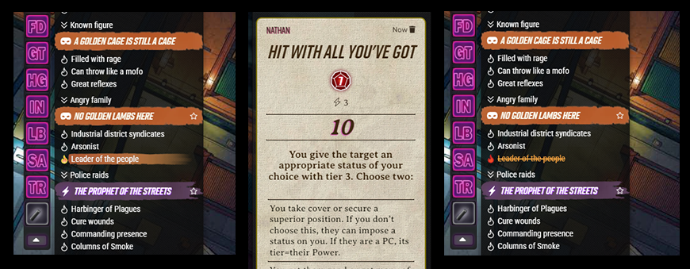

Otherscape: Burn for Power >> multiple "to burn" tags are counted
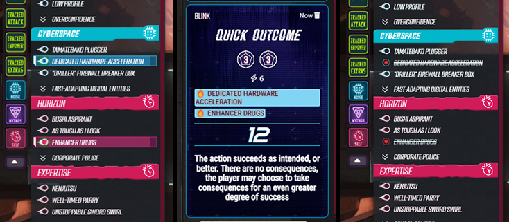

Click on the burn icon to toggle between the states: unburned, to burn and burned. A burned tag cannot be selected until you restore the state to unburned.

### Help & Hurt (City of Mist only)

On the side panel, use the **Help & Hurt** section to give the bonus modifier to your crew members. The arrow direction helps you remember if it's a positive (help) or negative (hurt) modifier. You must create the item on the character sheet.

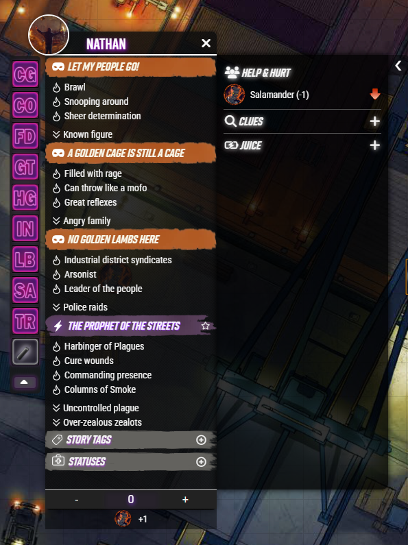

When one of your companions gives you the bonus it appears on the bottom of the HUD, hover over the image to see the name.

_In Otherscape: Relationships of the crew members are done with **Story Tags**, you need to inform the player and he/she can apply the appropriate modifier using the +/- buttons at the bottom of the HUD._

### Improvements and Automatic Attention/Upgrades

When you roll using a weakness tag the hud automatically registers one point of Attention/Upgrade. Mouse over the themebook icon to check your current points (only informative).

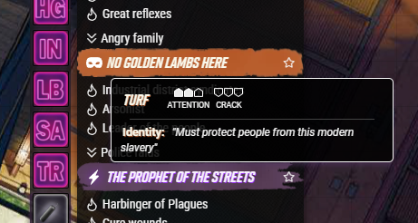

When you gain an improvement a star appears on the themebook title. Open the character sheet to update your Rift (flip the themebook to locate it).

## NPC's HUD: Easy Control for the MC

**RIGHT-CLICK** on any Danger/Threat token to bring their HUD up.

If there is any  Description / Biography for your Danger you can click the title to reveal the text. If there isn't, this title section is hidden to save space.

The plus signs on the Tags & Statuses section create new items for each one.
Tags have 4 states: neutral, negative, positive, burned
Statuses have 3 states: neutral, negative, and positive

Clicking on them toggle their states. **Positive and negative states affect the rolls of the players.**

**Delete any tag or status by Right Click** on them. There is no confirmation dialog or undo option, create a new one to replace wrongfully deleted ones. (Hey, fast paced has a price...)

**Edit any tag or status by Double Click** on them.

### Collective Size / Scale

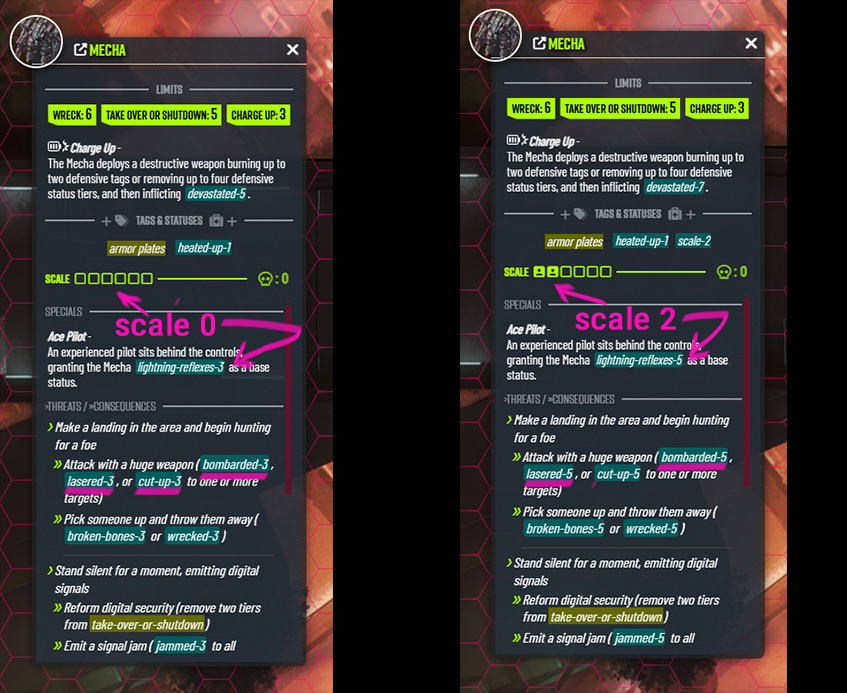

Click on the bar to set the Collective Size / Scale of the Dangers/Threats. Clicking on the label to zero it. The value will be added automatically to all statuses inflicted by this npc.

### Otherscape and LitM Threat Moves How to:

Choosing the right type of moves in your Danger sheet will present them with the correct format when the active system is Otherscape. Check below:

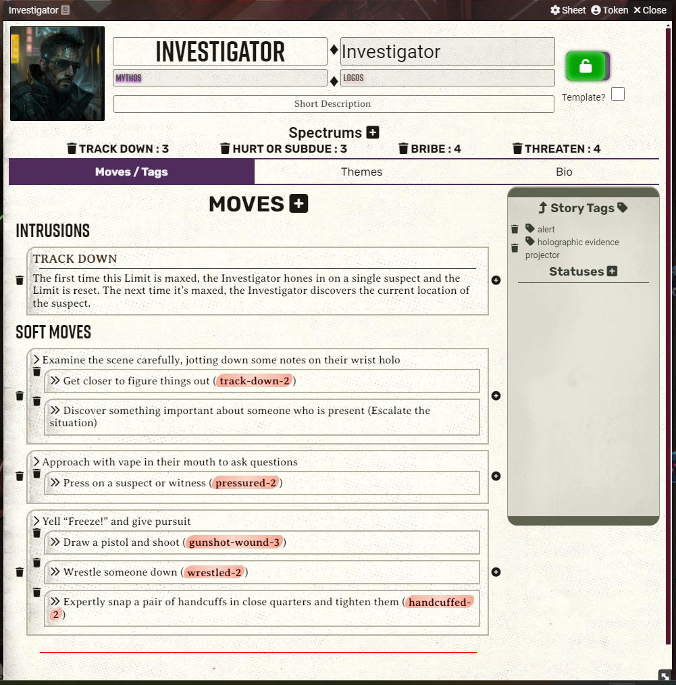

- **Limits:** Intrusions >> the battery icon will be added automatically
- **Specials:** Hard Moves >> don't forget the move name
- **Threats:** Soft Moves >> Hide Move Name, Move Header = Symbols
- **Consequences:** Soft Move submove (click on the + inside the parent Soft Move/Threat) >> Hide Move Name, Move Header = Symbols
- **Might (_LitM only_):** Custom moves >> check the table below to learn how to display the correct icon and the description text you want

| Input Syntax | Icon Type | Example Input | Rendered Output |
|--------------|-----------|---------------|-----------------|
| `--G--` | Greatness | `--G-- Mighty Strike` |  Mighty Strike |
| `--A--` | Adventure | `--A-- Swift Movement` |  Swift Movement |
| `--O--` | Origin | `--O-- Old Wisdom` |  Old Wisdom | 

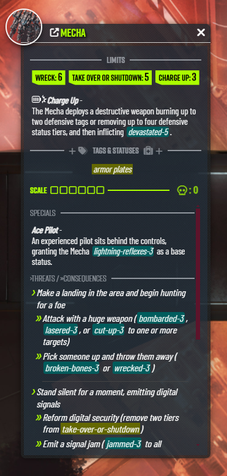

_City of Mist Dangers doesn't require any special formatting._

## Statuses MC Screen

There is a list statuses organized by categories. Click on the List button on the Token Controls to activate it. You can drag and drop the statuses from the list on any token to assign it to it.

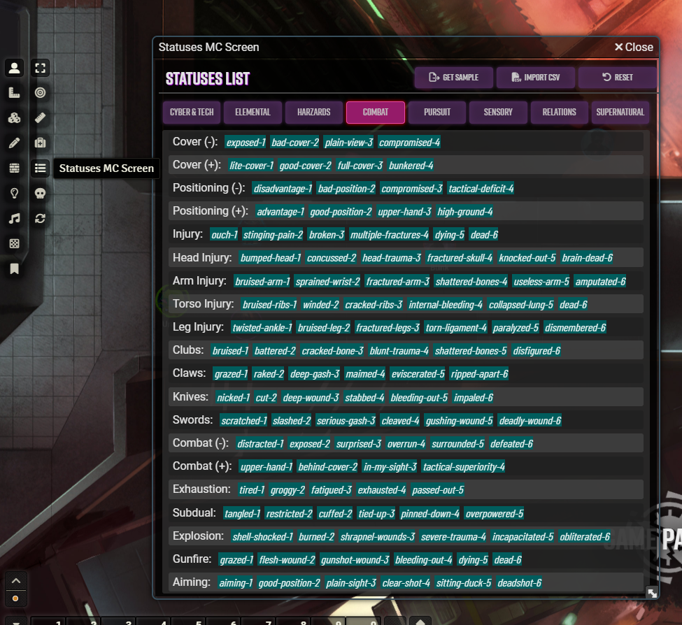

If you want to create your own list of statuses, you can click on the **Get Sample** button to export an example CSV (Comma Separated Values). Fill it with your own data, save it, and import the CSV using the **Import CSV button**, this will replace the default list. Remember that you need to keep the first line, or header, as is: 

**category,status_type,tier_1,tier_2,tier_3,tier_4,tier_5,tier_6**

If you want to go back to the default list use the **Reset** button.

## NPC Influence Viewer

Clicking on the skull icon in the Token Controls displays the NPC Influence Viewer. It displays the total value of the current influence of your Dangers/Threats over the PCs rolls. There are two tabs: one displays only NPCs influencing the scene and the other displays all the NPCs on the scene.

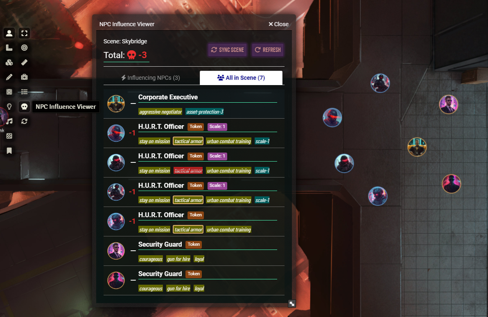

- Token tag: means the NPC is not sharing data with the other instances (Link Actor Data is off)
- Scale tag: shows the current Collective size / Scale of the threat.
- Click on the image automatically selects and pans your view to the NPC on the game map.

If for any reason the player's rolls are not using the correct value click on **Sync Scene** to update the rolls modifiers. To update the viewer with the actual values click on the **Refresh** button.

## Settings

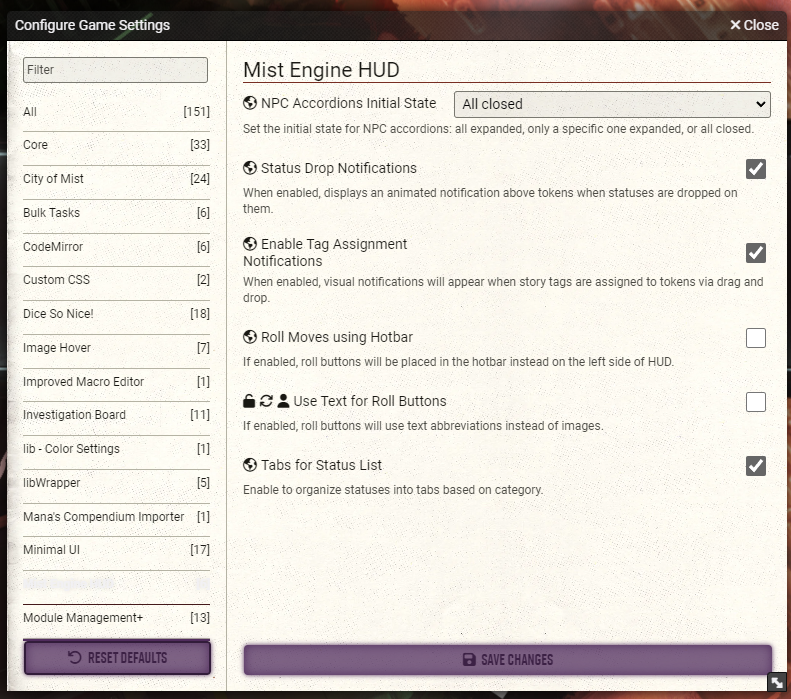

In the Mist HUD settings, you can:

- set the initial state of accordion menus (open or closed)
- activate game-like notifications of dropped tags/statuses
- Choose between using hotbar macros or side buttons for rolls
- Choose between using hotbar macros or side buttons for rolls
- choose if the moves roll buttons should be displayed as text (good if you're using other language than English)
- determine if your Statuses List displays as divided categories or all in one page

## Compendiums

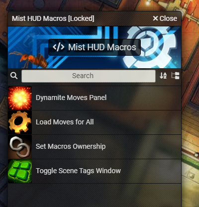

Drag and drop them on your hotbar if you want or just execute them from the compendiums. The _Load Moves for All_ and _Set Macros Ownership_ allow the MC to fast assign the macros to the players if you opt to roll using the hotbar instead of the side buttons in the module settings. 
 
### Dynamite Rolls and Dynamite Move Control Panel (City of Mist only)

If your next roll can be Dynamite, click first on the _Is Dynamite!_ button then on the roll button. If you got 12+ the correct outcome will appear in the chat roll. When you have an improvement that makes a move Dynamite check if you have it correctly assigned in your Improvements section of the character sheet. In this case, the effect will be automatic, no need to activate the button first.

Now, if one of the Rifts movements is always Dynamite the MC can toggle this by using the **Dynamite Move Control Panel** macro in the compendiums.

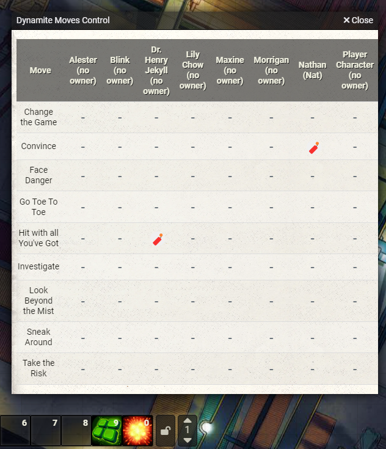

## Known Issues

- The NPC Influence viewer not always displays the updated values. Use the buttons there to solve this issue.
- Help and Hurt bonuses only works correctly between players, but not if thye MC do the roll. the players must have the correct ownership of the character and also need to have limited ownership of the others.
- When you close the HUD you need to deselect your token and select it again.

## Compatibility

This module is designed for Foundry VTT version 12.

## License

This project is licensed under the MIT License. Check the LICENSE file for more details.
